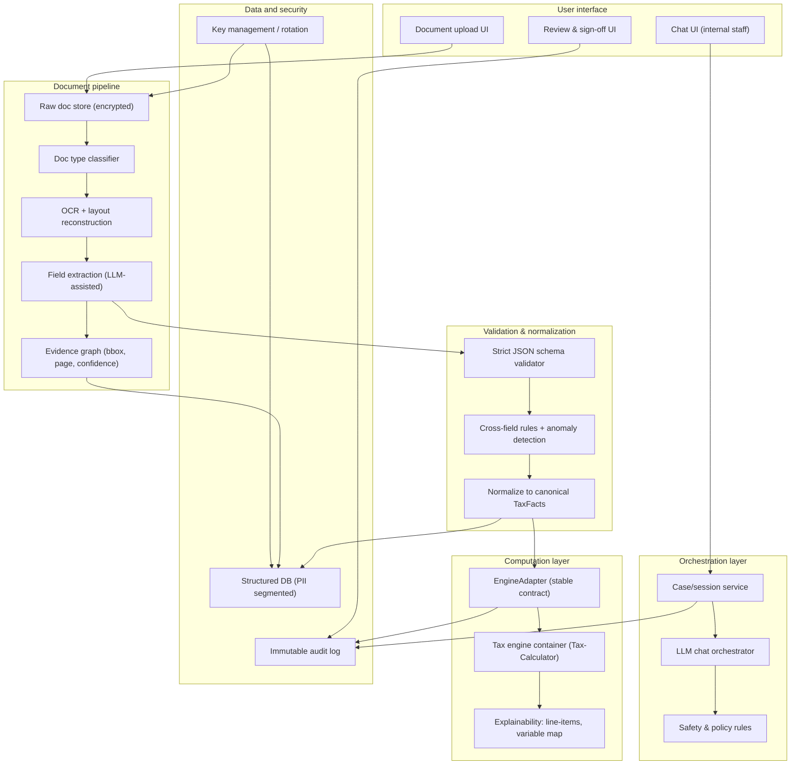
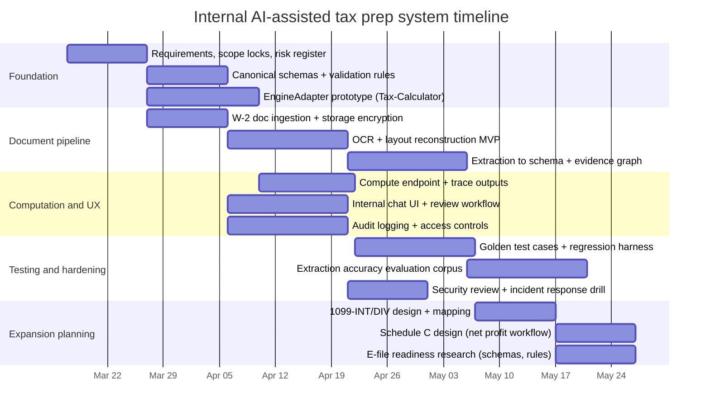

# Building an Internal US-Only AI-Assisted Tax Preparation System

## Executive summary

You can build a powerful internal tax preparation system by combining (a) a deterministic open-source tax engine for calculations and (b) LLM-driven workflows for intake, document understanding, and user-facing conversation. The core design rule is: **LLMs never compute taxes**. They only transform messy inputs into structured facts, ask clarifying questions, and explain results. All tax math and thresholds come from the engine and the year-specific rule set. citeturn8view1turn8view2turn28view0turn21view5turn13search3

**Recommended engine for your constraints (US-only, internal-first, no PTIN/EFIN today): Tax-Calculator.**  
Rationale: it is explicitly designed as an open-source microsimulation model of US federal income and payroll taxes citeturn6view1turn28view0, accepts custom data via DataFrame/CSV citeturn8view1turn8view2, and is released into the public domain in the entity["country","United States","country"] with a CC0 dedication worldwide, which gives you maximum freedom to productize later. citeturn27view0turn7search13

**Why not PolicyEngine/OpenFisca as the primary core (for you, right now): licensing and product strategy risk.**  
PolicyEngine US is also powerful and includes state and federal modeling, but it is AGPL-licensed citeturn19view0turn6view2, and OpenFisca is AGPL-licensed. citeturn27view1turn6view3 AGPL is intentionally “network-service copyleft,” meaning if you later expose a modified AGPL engine through a service, you typically must provide corresponding source to the users of that service. citeturn6view3turn27view1 That may be acceptable, but it should be a deliberate choice, not an accident.

**MVP recommendation:** restrict to W-2 wages and withholding, filing status, dependents, standard deduction (including age/blind adjustments), and a minimal credit set (start with none or only Child Tax Credit once your dependent model is solid). Base the year on the target form year, for example TY2025 (returns filed in 2026). citeturn4search0turn26view0turn22view5turn21view4

**Compliance posture:** because you have no PTIN/EFIN today, treat this as an internal tool for your own organization’s workflows, not a public filing or paid preparation service. If you eventually prepare returns for compensation, the entity["organization","Internal Revenue Service","us tax agency"] requires a PTIN for anyone who prepares or assists in preparing federal returns for compensation. citeturn24view0turn24view2 E-filing for clients requires becoming an authorized e-file provider and passing suitability checks. citeturn24view1turn25view0turn25view2

## Core engine choice and license implications

### What the engines are optimized for

**Tax-Calculator** is built for static analysis of US federal individual income and payroll taxes. It explicitly describes itself as a model for static analysis, and its roadmap states it “does only static analysis of federal individual income and payroll taxes,” relying on other models for business taxes or non-static analysis. citeturn28view0turn7search6turn6view1 This is a good fit for your internal system if you accept that you must build your own “tax prep workflow” around it.

**PolicyEngine US** is a microsimulation model of US state and federal tax and benefit systems. citeturn19view0turn0search5 It is built atop a rules-as-code style where parameters are YAML and variables are Python logic. citeturn20view0 This is attractive for long-range extensibility, especially state return modeling, but the license posture is the major tradeoff.

**OpenFisca** is a generalized rules-as-code engine with a web API that accepts JSON describing entities and time periods (for example `/calculate`, `/trace`). citeturn13search3turn13search5turn27view1 It is powerful if you want an explainable, traceable rule engine design, but again the AGPL licensing is central.

### License tradeoffs and what they mean in practice

Tax engines are not like small libraries. You will integrate deeply and update year-over-year. License constraints can become a business constraint.

| Engine | Domain scope | Integration style | License posture | Practical implication for you |
|---|---|---|---|---|
| Tax-Calculator | Federal income + payroll tax microsimulation | Python library; custom records via DataFrame/CSV | Public domain in the US + CC0 worldwide citeturn27view0turn7search13 | Lowest licensing friction for internal use and later commercialization |
| PolicyEngine US | Federal + state tax-benefit microsimulation | Python rules engine; parameters in YAML; variables in Python citeturn19view0turn20view0 | AGPL-3.0 citeturn19view0turn6view2 | If you modify and later expose as a service, you generally must offer corresponding source to service users citeturn6view2turn6view3 |
| OpenFisca core | General tax-benefit rules engine | Python core + web API endpoints like `/calculate` with JSON I/O citeturn13search3turn13search5turn13search9 | AGPL citeturn27view1turn6view3 | Same network-service copyleft concerns; OpenFisca docs explicitly discuss obligations when serving over a network citeturn27view1 |

**Why Tax-Calculator fits “internal-first then possibly product” best:** it is CC0/public domain, so you can wrap it behind internal services now and later transition to commercial distribution without being forced into open-sourcing your proprietary “workflow and platform layer.” citeturn27view0turn8view1

**A key maintenance signal:** Tax-Calculator’s policy code includes a “last known year” constant (example: `LAST_KNOWN_YEAR = 2026`) and a budget horizon, implying an explicit annual update cadence expectation. citeturn12view2 This matters because tax systems fail when rule updates lag.

### Recommendation

Use **Tax-Calculator as the canonical computation engine** in your first build. Keep **EngineAdapter** clean enough that you can later add PolicyEngine as a secondary engine for state modeling or benefit interactions, but only if you accept AGPL downstream obligations and you want its broader scope. citeturn19view0turn27view1turn28view0

## Architecture and API contracts

### High-level architecture

Your architecture should implement two hard separations:

1) **Conversation and extraction layer** (LLMs + OCR): produces **structured facts with provenance** and a list of unresolved questions.  
2) **Computation layer** (engine): consumes only validated facts and produces authoritative outputs.

This aligns with AI risk management guidance that emphasizes understanding context and managing risk to cultivate trust. citeturn21view5turn13search1



### Components and implementation notes

**LLM chat and intake orchestration**
- Drives the interview, but outputs only structured JSON plus clarifying questions.
- Retrieves authoritative references (internal knowledge base, IRS instructions you store) and attaches citations to responses, rather than relying on model memory. citeturn21view5turn21view7turn26view0

**OCR and document pipeline**
- Accepts PDFs/images, performs classification (W-2 vs 1099, etc.), runs OCR, reconstructs layout, then uses extraction rules plus an LLM to map fields into schema.
- Must emit confidence scores and evidence pointers (page, bounding boxes), not just values. citeturn3search3turn30search0turn30search13

**EngineAdapter**
- A stable internal contract so you can swap engines without rewriting the whole platform.
- Encapsulates quirks: Tax-Calculator expects “records” shaped as a DataFrame/CSV with specific input variables. citeturn8view1turn8view2turn8view0

**Validation layer**
- Enforces strict schema and cross-field rules (example: W-2 Box 2 withholding must be non-negative; filing status must be one of recognized codes; dependent counts must reconcile). citeturn22view5turn26view0turn9view0

**Audit trail**
- Record who changed what, when, and why, plus which documents support each value.
- IRS tax-pro security guidance explicitly calls for implementing audit trails (audit logs) that record activities and changes. citeturn23view0turn23view2

### EngineAdapter API contract

A simple internal HTTP contract works even if you run everything in one monolith initially. The key is that every response includes engine versioning and a traceable mapping of outputs to inputs.

**Proposed endpoints**

| Endpoint | Purpose | Request body | Response body |
|---|---|---|---|
| `POST /v1/docs/extract` | Extract structured fields + evidence from uploaded docs | `{document_id, doc_type_hint}` | `{extracted_fields, evidence, confidence, warnings}` |
| `POST /v1/intake/normalize` | Normalize interview answers + doc extraction into canonical TaxFacts | `{intake_json, extracted_json}` | `{tax_facts, unresolved_questions, validation_errors}` |
| `POST /v1/tax/compute` | Compute tax results using EngineAdapter | `{tax_facts, tax_year, engine:"taxcalc"}` | `{results, line_items, trace, engine_meta, warnings}` |
| `POST /v1/case/signoff` | Capture human review decision | `{case_id, reviewer_id, decision, notes}` | `{status}` |

**EngineAdapter compute request example (conceptual)**

| Field | Type | Notes |
|---|---|---|
| `tax_year` | integer | TY2025 for Form 1040 (2025) citeturn22view5turn21view4 |
| `filing_status` | enum | Match engine expectations, for example Tax-Calculator `MARS` codes citeturn9view2turn14view1 |
| `w2_wages` | number | Map to Tax-Calculator `e00200` wages net of pension contributions citeturn9view0 |
| `dependents` | array | Stored as list internally; also derive counts like `n24`, `nu06`, etc. citeturn15view0turn15view3 |
| `fed_income_tax_withheld` | number | For MVP, use W-2 Box 2 in refund estimate logic (outside engine). See Form 1040 “Income” lines for W-2 integration context. citeturn22view5turn4search0 |
| `evidence_map` | object | Links each fact to doc evidence (page, bbox, extractor confidence) |

## MVP scope and phased roadmap

### Concrete MVP scope

The MVP should be optimized for correctness and controlled risk, not breadth.

**Supported case definition**
- TY2025 Form 1040 context (federal only). citeturn21view4turn22view5
- Income: W-2 wages only.
- Payments: federal income tax withheld (W-2 Box 2) for a simplified refund/balance estimate.
- Filing status: Single, MFJ, MFS, HOH, QSS captured and validated (your system should preserve all five statuses even if the user’s docs do not mention them, mirroring how rules engines structure categories). citeturn22view5turn20view0turn26view0
- Dependents: capture identity fields and eligibility indicators; derive child counts used by engines (for example `n24` “Child-Tax-Credit eligible under 17” and `nu06` dependents under 6). citeturn15view0turn15view3
- Deductions: standard deduction only, including age 65+ and blindness adjustments. citeturn26view0turn22view5
- Credits: start with none, or add Child Tax Credit only once dependent and SSN validation is solid (because wrong dependent eligibility is a high-frequency error surface). Publication 501 provides the standard deduction structure and dependent limitation rules that you can encode and test early. citeturn26view0turn15view0

### Phased roadmap to expand coverage

**Phase expansion should follow document types, not forms.** Most internal tax workflow pain comes from documents (W-2, 1099 variants, K-1, etc.) and their extraction/validation.

| Phase | Additions | Engine inputs impacted | Key risk to manage |
|---|---|---|---|
| Early expansion | 1099-INT, 1099-DIV | Add interest/dividends variables (Tax-Calculator inputs include taxable interest `e00300` and dividends `e00600`) citeturn16view3turn16view4 | Misclassification of income types; missing boxes |
| Capital market expansion | 1099-B and Schedule D | Map to short/long gains variables (Tax-Calculator includes `p22250` short-term and `p23250` long-term gain/loss variables) citeturn17view0 | Basis and lot-level complexity; extraction error amplification |
| Self-employed expansion | Schedule C workflow | Tax-Calculator has a net profit/loss input `e00900` (Schedule C net) citeturn9view1 | You must compute net profit correctly from upstream books; receipts and expense categorization are messy |
| State returns | Add state calculation engine | Consider adding PolicyEngine US for state modeling citeturn19view0 | Major surface area; license strategy; state-by-state rule drift |
| E-file readiness | MeF schemas, business rules, ATS testing | IRS distributes schemas/business rules for MeF and provides program info; e-file provider onboarding requires suitability processes citeturn1search5turn1search9turn25view2turn24view1 | Compliance, approvals, and security requirements become mandatory, not optional |

## Data models, extraction strategy, and LLM guardrails

### Canonical data model philosophy

Maintain **three representations** of the case in parallel:

1) **Raw evidence layer**: documents, OCR text, bounding boxes.  
2) **Canonical TaxFacts layer**: human-auditable tax facts (wages, dependents, filing status).  
3) **Engine-specific layer**: engine variables (Tax-Calculator input vars such as `MARS`, `RECID`, `e00200`, `n24`). citeturn14view1turn9view0turn15view0turn8view1

This lets you re-run calculations if the engine changes, while keeping evidence stable.

### Strict JSON schemas (examples)

Below are representative schema patterns. The enforcement point is your validator service, not the LLM.

**TaxFacts intake schema (illustrative)**

```json
{
  "$schema": "https://json-schema.org/draft/2020-12/schema",
  "$id": "https://yourcompany.local/schemas/taxfacts.json",
  "type": "object",
  "additionalProperties": false,
  "required": ["tax_year", "filing_status", "primary_taxpayer", "income", "dependents", "payments", "evidence"],
  "properties": {
    "tax_year": { "type": "integer", "minimum": 2013, "maximum": 2035 },
    "filing_status": {
      "type": "string",
      "enum": ["SINGLE", "MFJ", "MFS", "HOH", "QSS"]
    },
    "primary_taxpayer": {
      "type": "object",
      "additionalProperties": false,
      "required": ["first_name", "last_name", "dob", "is_blind"],
      "properties": {
        "first_name": { "type": "string", "minLength": 1 },
        "last_name": { "type": "string", "minLength": 1 },
        "dob": { "type": "string", "format": "date" },
        "is_blind": { "type": "boolean" }
      }
    },
    "spouse": {
      "type": ["object", "null"],
      "additionalProperties": false,
      "required": ["first_name", "last_name", "dob", "is_blind"],
      "properties": {
        "first_name": { "type": "string", "minLength": 1 },
        "last_name": { "type": "string", "minLength": 1 },
        "dob": { "type": "string", "format": "date" },
        "is_blind": { "type": "boolean" }
      }
    },
    "income": {
      "type": "object",
      "additionalProperties": false,
      "required": ["w2"],
      "properties": {
        "w2": {
          "type": "array",
          "minItems": 1,
          "items": {
            "type": "object",
            "additionalProperties": false,
            "required": ["employer_name", "wages_box1", "fed_withheld_box2"],
            "properties": {
              "employer_name": { "type": "string", "minLength": 1 },
              "wages_box1": { "type": "number", "minimum": 0 },
              "fed_withheld_box2": { "type": "number", "minimum": 0 }
            }
          }
        }
      }
    },
    "dependents": {
      "type": "array",
      "items": {
        "type": "object",
        "additionalProperties": false,
        "required": ["first_name", "last_name", "dob", "relationship", "has_ssn", "lived_with_taxpayer_over_half_year"],
        "properties": {
          "first_name": { "type": "string", "minLength": 1 },
          "last_name": { "type": "string", "minLength": 1 },
          "dob": { "type": "string", "format": "date" },
          "relationship": { "type": "string" },
          "has_ssn": { "type": "boolean" },
          "lived_with_taxpayer_over_half_year": { "type": "boolean" }
        }
      }
    },
    "payments": {
      "type": "object",
      "additionalProperties": false,
      "required": ["fed_income_tax_withheld"],
      "properties": {
        "fed_income_tax_withheld": { "type": "number", "minimum": 0 }
      }
    },
    "evidence": {
      "type": "object",
      "additionalProperties": false,
      "required": ["facts"],
      "properties": {
        "facts": {
          "type": "array",
          "items": {
            "type": "object",
            "additionalProperties": false,
            "required": ["fact_path", "document_id", "page", "bbox", "ocr_confidence"],
            "properties": {
              "fact_path": { "type": "string" },
              "document_id": { "type": "string" },
              "page": { "type": "integer", "minimum": 0 },
              "bbox": {
                "type": "array",
                "minItems": 4,
                "maxItems": 4,
                "items": { "type": "number" }
              },
              "ocr_confidence": { "type": "number", "minimum": 0, "maximum": 1 }
            }
          }
        }
      }
    }
  }
}
```

**Tax-Calculator engine input mapping schema (illustrative)**  
This is generated by your normalizer, not by the LLM.

```json
{
  "engine": "taxcalc",
  "engine_version": "x.y.z",
  "tax_year": 2025,
  "records": [
    {
      "RECID": 1,
      "MARS": 2,
      "FLPDYR": 2025,
      "e00200": 75000,
      "n24": 1,
      "nu06": 0,
      "nu13": 1,
      "blind_head": 0,
      "blind_spouse": 0,
      "age_head": 40,
      "age_spouse": 0,
      "s006": 1.0
    }
  ]
}
```

Tax-Calculator documents that the Records object can be created from a DataFrame or CSV, and it documents key required inputs such as `MARS` and `RECID`, plus wage variables like `e00200` and dependent counters like `n24` and `nu06`. citeturn8view1turn14view1turn9view0turn15view0turn15view3

### Document extraction strategy

image_group{"layout":"carousel","aspect_ratio":"16:9","query":["IRS Form W-2 Wage and Tax Statement sample","IRS Form 1099-INT sample","IRS Form 1099-DIV sample","IRS Form 1099-B sample"],"num_per_query":1}

W-2 and 1099 documents vary by issuer formatting, which makes robust extraction more about **layout reconstruction + validation** than OCR alone. IRS publishes Form W-2 and related instructions as the canonical reference for what the fields mean. citeturn4search0turn26view1

**Recommended extraction pipeline**
- Step A: detect whether the PDF has an embedded text layer; if so, parse text and coordinates first (often higher accuracy than OCR).
- Step B: if image-based, run OCR and layout:
  - detect lines/blocks
  - detect key-value patterns around W-2 box labels
  - create candidate field regions for each box
- Step C: LLM-assisted mapping:
  - given OCR blocks and coordinates, have the LLM output JSON matching your schema plus evidence pointers
  - enforce that every extracted monetary field includes at least one evidence span
- Step D: validation:
  - example cross-checks for W-2: Box 2 withholding cannot exceed Box 1 wages by unreasonable ratios; missing SSN triggers “review required”; multiple W-2s must aggregate. (These are heuristics; your system should label them as warnings, not hard errors.)

**OCR options and tradeoffs**

| Option | Type | Strengths | Weaknesses | Evidence |
|---|---|---|---|---|
| Tesseract | Open source OCR engine | Local processing; license is Apache 2.0 citeturn3search0turn3search12 | Weaker on complex layouts; more engineering to reconstruct tables/fields | citeturn3search0turn3search12 |
| PaddleOCR | Open source OCR toolkit | Positioned for turning PDFs/images into structured data; broad language support (project claim) citeturn3search1turn3search9 | Requires ML ops and tuning; dependency scrutiny needed | citeturn3search1turn3search9 |
| docTR | Open source deep learning OCR | Designed for detection + recognition; Apache 2.0 citeturn3search2 | GPU helpful; still needs downstream field mapping logic | citeturn3search2 |
| Amazon Textract | Managed OCR + document analysis | Returns structured elements like forms, tables, and query responses citeturn3search3turn3search11 | Sends data to a third party cloud; cost; vendor lock-in | citeturn3search3turn3search11 |
| Google Document AI Form Parser | Managed form extraction | Extracts key-value pairs, tables, selection marks, and text citeturn30search0 | Cloud dependency; pre-trained parser cannot be up-trained (per docs) citeturn30search0 | citeturn30search0turn30search2 |
| Azure Document Intelligence | Managed OCR + document understanding | Extracts text, tables, structure, key-value pairs citeturn30search13turn30search3 | Cloud dependency; integration and cost considerations | citeturn30search13turn30search3 |

For an internal-first build, many teams start with a managed OCR to reduce time-to-value, then migrate sensitive workloads to local open-source OCR if costs or privacy constraints demand it. Your IRS-aligned security posture should assume taxpayer data sensitivity regardless of whether you are “public” yet. citeturn23view0turn21view6

### LLM prompt patterns and safety rules

Your LLM system should be organized into roles with explicit constraints.

**Pattern: Interview agent**
- Goal: gather missing facts.
- Hard rules:
  - never compute tax outcomes directly
  - never “guess” missing numbers
  - always ask targeted clarifying questions when required fields are missing
  - when answering “why,” cite internal sources or IRS documents you have retrieved for that question

This aligns with AI RMF concepts around managing risks and increasing trustworthiness through disciplined design and governance. citeturn21view5turn13search7

**Pattern: Extraction agent**
- Goal: extract from documents.
- Hard rules:
  - output must be valid JSON that passes schema
  - every monetary field must include evidence (doc id, page, bbox, OCR confidence)
  - if confidence is below threshold, mark as `"needs_review": true` and ask a follow-up question rather than “filling in” a guess

**Pattern: Explanation agent**
- Goal: explain engine outputs.
- Hard rules:
  - do not restate values without referencing engine outputs and the trace map
  - disclaim that final filing decisions require qualified review if the user is not credentialed (internal labeling, not public marketing)

**Example safety rule set (design)**
- “The engine is the source of truth for calculations.”
- “The model may summarize and explain; it may not invent thresholds or compute new totals.”
- “When the user asks ‘what should I do,’ the model must either (a) point to a documented rule source or (b) route to human review.”

## Testing strategy and human-in-loop governance

### Testing layers

**Schema and validation tests**
- Unit tests for JSON schema and cross-field validation.
- Include adversarial cases: missing fields, negative amounts, mixed filing status signals, impossible dependent DOBs.

**Engine regression tests with golden files**
- For each supported scenario, store:
  - canonical TaxFacts JSON
  - engine input JSON
  - engine output snapshot (selected variables and line items)
- Re-run on every engine bump. Tax-Calculator evolves policy years and parameters, so regression tests catch drift. citeturn12view2turn28view0

**Document extraction tests**
- Build a test corpus of W-2 PDFs from different issuers and scan qualities (redacted SSNs).
- Score:
  - field-level precision/recall for Box 1 and Box 2
  - evidence correctness (bbox points to the right printed value)
- Fail the pipeline if extraction returns high confidence but wrong evidence.

**LLM behavior tests**
- Prompt-unit tests:
  - “Return JSON only” compliance
  - refusal to compute tax in free text
  - correct triggering of clarifying questions
- Policy-based tests:
  - ensure model refuses to present itself as a credentialed preparer when it is not

### Human-in-loop checkpoints

Because you have no PTIN/EFIN, your internal process must include human accountability gates even before you serve external clients.

**Recommended checkpoint design**
- Checkpoint: “Extraction review”
  - any field with confidence < threshold requires human confirmation
- Checkpoint: “Return logic review”
  - reviewer verifies filing status, dependent eligibility signals, W-2 totals
- Checkpoint: “Final sign-off”
  - required before any value is used for filing decisions, client delivery, or advisorial outputs

IRS guidance for practitioners emphasizes security steps including reviewing return information before e-filing and maintaining audit logs. citeturn23view0turn23view2

**Why you should formalize labeling now**
- If you later expand into paid preparation, PTIN requirements apply to compensated preparers and those assisting substantially in preparation. citeturn24view0turn24view2
- Practitioner rules governing practice before the IRS are described in Circular 230, which defines scope and governs recognized practitioners and others. citeturn21view2

## Deployment, infrastructure, and security posture

### Security baseline for taxpayer data

Even internal-only systems should treat the data as highly sensitive PII and taxpayer information.

- entity["organization","National Institute of Standards and Technology","us standards agency"] guidance emphasizes protecting PII from inappropriate access, use, and disclosure and recommends safeguards and incident response planning. citeturn21view6turn2search18
- IRS Publication 4557 provides concrete operational security steps for tax professionals, including MFA, encryption of sensitive files/emails, limiting access to those who need-to-know, and implementing audit logs. citeturn23view0turn23view1
- If you ever become an e-file provider, IRS Publication 1345 includes security and privacy standards such as TLS requirements, external vulnerability scans, written privacy and safeguard policies, and incident reporting requirements for providers. citeturn22view0turn22view1

### Recommended infrastructure controls

**Data storage**
- Separate raw-doc storage (object store) from structured data (relational DB).
- Encrypt at rest, rotate keys; store keys in a KMS and rotate routinely.
- Tokenize or vault SSNs when possible (minimize blast radius).

**Audit logging**
- Immutable append-only logs for:
  - document upload/download
  - extracted field edits
  - engine compute calls
  - sign-off decisions
- Publication 4557 explicitly calls for audit logs that record who, when, and what changes were made. citeturn23view0

**Access controls**
- Role-based access, least privilege, MFA, short-lived sessions for administrators.
- “Need to know” access is repeatedly emphasized in IRS practitioner security guidance. citeturn23view0turn23view1

**Incident response**
- Define what qualifies as a security incident, escalation, and containment steps.
- If you later become an online e-file provider, Publication 1345 sets specific incident reporting expectations and requires ceasing collection if the website is the cause until resolved. citeturn22view1turn22view0

### SOC 2 considerations

If you intend to serve external business clients later (even if today is internal-only), align early with the entity["organization","AICPA & CIMA","accounting association"] Trust Services Criteria concepts. SOC 2 is described as a report on controls relevant to security, availability, processing integrity, confidentiality, or privacy. citeturn29view0turn29view1

## Compliance milestones, resourcing, and timeline

### Compliance milestones for a future expansion

You are not doing public filing service now, but you should design your workflow so it can mature without re-architecture.

- PTIN: required for compensated preparers and those who substantially assist in preparation. citeturn24view0turn24view2
- Authorized e-file provider (EFIN pathway): IRS outlines steps and suitability checks; Publication 3112 illustrates the application stages and indicates the IRS may take up to 45 days to approve an application. citeturn24view1turn25view0turn25view2
- MeF readiness: the IRS provides program information and distributes schemas/business rules for developers/transmitters, which becomes relevant for any e-file readiness work. citeturn1search5turn1search9turn1search1

### Resource estimate and assumptions

Assumptions (explicit):
- You want a working internal MVP in roughly one quarter.
- You can dedicate engineering time consistently.
- You can access a tax SME (contract or partner) for review of edge cases even if you are not credentialed yet.

**Minimum team (lean but realistic)**
- Backend engineer (1.0 FTE): APIs, DB, EngineAdapter, validation
- ML/OCR engineer (0.5 FTE): OCR pipeline, layout mapping, eval harness
- Full-stack engineer (0.5 FTE): internal UI, review flows
- Security engineer (0.25 FTE): threat model, logging, encryption, access controls
- Tax SME (0.25 FTE): scope discipline, scenario definition, review checklists

### Phased timeline



### What “done” looks like for the MVP

A usable internal MVP is not “the chat works.” It is all of the following:

- You can upload one or more W-2s and extract Box 1 wages and Box 2 withholding with evidence pointers.
- The system can produce a validated TaxFacts JSON, derive Tax-Calculator inputs (`MARS`, `RECID`, `e00200`, `n24`, etc.), and compute an authoritative tax result. citeturn14view1turn9view0turn15view0turn8view1
- Every computed field shown to a user has:
  - engine trace mapping
  - document evidence mapping
  - human review status
- Audit logs capture all actions and edits. citeturn23view0turn23view2
- Security posture follows practitioner-grade expectations for encryption, MFA, and least privilege consistent with IRS guidance. citeturn23view0turn22view0turn21view6